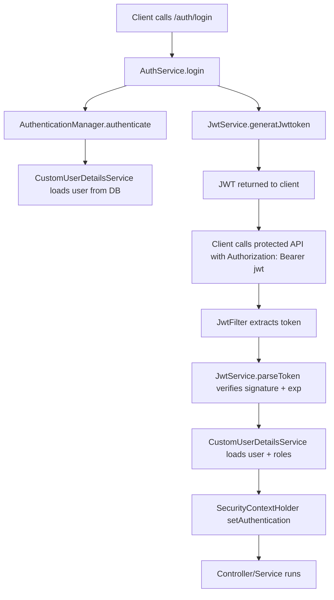
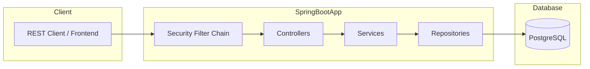
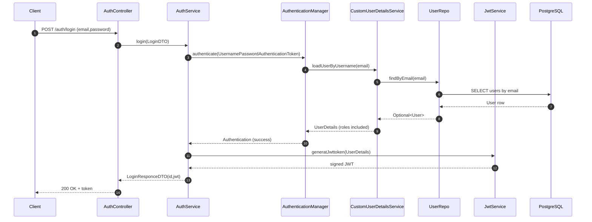
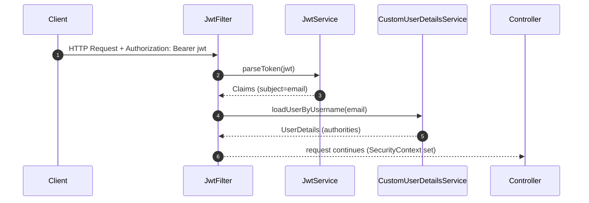

# security_setup_with-JWT

## Project Introduction
- Ye project Spring Boot me authentication + authorization ka complete, interview-ready example hai.
- Core problem: user ko securely login karwana, JWT token generate karna, aur protected APIs ko role-based access dena (ADMIN / STUDENTS / FACULTY).
- Is project ka goal production-style security flow samjhana hai:
  - username/password authentication (Spring Security AuthenticationManager)
  - JWT generation + validation (JJWT library)
  - SecurityContext population (filter chain ke through)
  - DB-backed users (JPA + PostgreSQL)

## Tech Stack (and WHY)
- Java 21
  - Project `pom.xml` me `java.version=21` set hai.
- Spring Boot (Parent: `spring-boot-starter-parent:4.1.0`)
  - Fast application bootstrap + auto-configuration.
- Spring WebMVC
  - REST endpoints (`@RestController`) banane ke liye.
- Spring Security
  - AuthenticationManager, UserDetailsService, PasswordEncoder, filter chain, role-based authorization ke liye.
- JWT (JJWT: `io.jsonwebtoken`)
  - Stateless authentication: server session store nahi karta, har request me token validate hota hai.
- Spring Data JPA + Hibernate
  - Repository pattern + ORM mapping (`@Entity`) se DB operations simple ho jate hai.
- PostgreSQL Driver
  - Real database integration (properties file me datasource config present hai).
- Bean Validation (Jakarta Validation)
  - Request DTO validations (`@NotBlank`, `@Email`, etc.).
- Lombok
  - Boilerplate code reduce (getters/setters/constructors).
- Maven
  - Build + dependency management (`mvn test`, `mvn spring-boot:run`).

## Project Structure (Package-by-Package)
Base package: `com.chaiorcode.mycode`

- `Controller`
  - REST layer (HTTP request/response handling).
  - Files:
    - [AuthController.java](file:///c:/Users/Ranjeet/chaiorcode/mycode/mycode/src/main/java/com/chaiorcode/mycode/Controller/AuthController.java)
    - [StudentController.java](file:///c:/Users/Ranjeet/chaiorcode/mycode/mycode/src/main/java/com/chaiorcode/mycode/Controller/StudentController.java) (placeholder)
    - [FacultyController.java](file:///c:/Users/Ranjeet/chaiorcode/mycode/mycode/src/main/java/com/chaiorcode/mycode/Controller/FacultyController.java) (placeholder)
    - [AdminController.java](file:///c:/Users/Ranjeet/chaiorcode/mycode/mycode/src/main/java/com/chaiorcode/mycode/Controller/AdminController.java) (not a REST controller yet)
- `Service`
  - Business logic layer.
  - Files:
    - [AuthService.java](file:///c:/Users/Ranjeet/chaiorcode/mycode/mycode/src/main/java/com/chaiorcode/mycode/Service/AuthService.java) (register + login + JWT generation)
    - [CustomUserDetailsService.java](file:///c:/Users/Ranjeet/chaiorcode/mycode/mycode/src/main/java/com/chaiorcode/mycode/Service/CustomUserDetailsService.java) (DB → UserDetails mapping)
- `Repo`
  - Data access layer (Spring Data repositories).
  - Files:
    - [UserRepo.java](file:///c:/Users/Ranjeet/chaiorcode/mycode/mycode/src/main/java/com/chaiorcode/mycode/Repo/UserRepo.java)
- `Entity`
  - Database entities (`@Entity`) + enums.
  - Files:
    - [User.java](file:///c:/Users/Ranjeet/chaiorcode/mycode/mycode/src/main/java/com/chaiorcode/mycode/Entity/User.java)
    - [Role.java](file:///c:/Users/Ranjeet/chaiorcode/mycode/mycode/src/main/java/com/chaiorcode/mycode/Entity/Role.java)
    - [EntityStudent.java](file:///c:/Users/Ranjeet/chaiorcode/mycode/mycode/src/main/java/com/chaiorcode/mycode/Entity/EntityStudent.java) (currently not used by controllers/services)
- `DTO`
  - Request/response contracts (controller layer se service layer tak).
  - Files:
    - [CreateUserDto.java](file:///c:/Users/Ranjeet/chaiorcode/mycode/mycode/src/main/java/com/chaiorcode/mycode/DTO/CreateUserDto.java)
    - [RegisterDTO.java](file:///c:/Users/Ranjeet/chaiorcode/mycode/mycode/src/main/java/com/chaiorcode/mycode/DTO/RegisterDTO.java)
    - [LoginDTO.java](file:///c:/Users/Ranjeet/chaiorcode/mycode/mycode/src/main/java/com/chaiorcode/mycode/DTO/LoginDTO.java)
    - [LoginResponceDTO.java](file:///c:/Users/Ranjeet/chaiorcode/mycode/mycode/src/main/java/com/chaiorcode/mycode/DTO/LoginResponceDTO.java)
- `security`
  - Spring Security configuration + JWT components.
  - Files:
    - [websecurityconfig.java](file:///c:/Users/Ranjeet/chaiorcode/mycode/mycode/src/main/java/com/chaiorcode/mycode/security/websecurityconfig.java) (SecurityFilterChain + PasswordEncoder + AuthenticationManager beans)
    - [JwtService.java](file:///c:/Users/Ranjeet/chaiorcode/mycode/mycode/src/main/java/com/chaiorcode/mycode/security/JwtService.java) (JWT generate + parse)
    - [JwtFilter.java](file:///c:/Users/Ranjeet/chaiorcode/mycode/mycode/src/main/java/com/chaiorcode/mycode/security/JwtFilter.java) (Authorization header se JWT validate karke SecurityContext set karta hai)

## Complete Request Flow (High Level)
Request lifecycle ko simple flow me:

Client
↓
Spring Security Filter Chain
↓
JwtFilter (Bearer token parse/validate)
↓
Controller
↓
Service
↓
Repository (JPA)
↓
PostgreSQL
↓
Response

### JWT Validation kaha hoti hai?
- `JwtFilter#doFilterInternal(...)` me:
  - `Authorization: Bearer <token>` header se token extract hota hai
  - `JwtService#parseToken(...)` signature + expiration verify karta hai
  - `CustomUserDetailsService#loadUserByUsername(email)` DB se user + role load karta hai
  - `SecurityContextHolder` me Authentication set hota hai

## Authentication Flow (Login from Scratch)
Login ka flow code ke according:

1) Client `POST /auth/login` call karta hai (body: email + password)
2) `AuthController#login(...)` service ko call karta hai
3) `AuthService#login(...)` me:
   - `AuthenticationManager.authenticate(new UsernamePasswordAuthenticationToken(email,password))`
   - Spring Security internally:
     - `CustomUserDetailsService.loadUserByUsername(email)` call hota hai
     - DB se `User` entity nikalti hai
     - PasswordEncoder (BCrypt) password verify karta hai
4) Authentication success hua to:
   - `JwtService.generatJwttoken(UserDetails)` JWT generate karta hai
   - response me `LoginResponceDTO(id, jwt)` return hota hai

## Authorization Flow (Roles / Who can access what)
Authorization rules `websecurityconfig#securityFilterChain(...)` me defined hai:

- `/auth/**` → `permitAll()` (login/register ke liye open)
- `/students/**` → `hasAnyRole("ADMIN", "STUDENT")`
- `/faculty/**` → `hasAnyRole("ADMIN", "FACULTY")`
- Baaki sab → `authenticated()`

Role checking ka main concept:
- `CustomUserDetailsService` `.roles(user.getRole().name())` set karta hai.
- Spring Security internally `ROLE_` prefix add karta hai:
  - `ADMIN` → `ROLE_ADMIN`
  - `FACULTY` → `ROLE_FACULTY`
  - `STUDENTS` → `ROLE_STUDENTS`

Important observation (derived from code):
- `Role` enum me value `STUDENTS` hai, lekin security config me `/students/**` ke liye `"STUDENT"` check ho raha hai.
  - Source: [Role.java](file:///c:/Users/Ranjeet/chaiorcode/mycode/mycode/src/main/java/com/chaiorcode/mycode/Entity/Role.java) vs [websecurityconfig.java](file:///c:/Users/Ranjeet/chaiorcode/mycode/mycode/src/main/java/com/chaiorcode/mycode/security/websecurityconfig.java)
  - Future developers ko roles naming consistent rakhna important hai.

## JWT Flow (Generation → Validation → SecurityContext)
### 1) JWT Generation
- Location: [JwtService#generatJwttoken](file:///c:/Users/Ranjeet/chaiorcode/mycode/mycode/src/main/java/com/chaiorcode/mycode/security/JwtService.java#L25-L33)
- Claims used:
  - `sub` (subject) = `userDetails.getUsername()` (email)
  - `iat` (issued at) = current time
  - `exp` (expiration) = current time + 15 minutes
- Signature:
  - HMAC key based on `jwt.secret` from [application.properties](file:///c:/Users/Ranjeet/chaiorcode/mycode/mycode/src/main/resources/application.properties)

### 2) JWT Validation
- Location: [JwtService#parseToken](file:///c:/Users/Ranjeet/chaiorcode/mycode/mycode/src/main/java/com/chaiorcode/mycode/security/JwtService.java#L35-L40)
- What happens:
  - Signature verify (same secret key)
  - Claims extraction (subject/email)

### 3) SecurityContext Population
- Location: [JwtFilter#doFilterInternal](file:///c:/Users/Ranjeet/chaiorcode/mycode/mycode/src/main/java/com/chaiorcode/mycode/security/JwtFilter.java#L21-L63)
- Steps:
  - token → claims → email
  - email → UserDetails (roles included)
  - UserDetails → `UsernamePasswordAuthenticationToken`
  - `SecurityContextHolder.getContext().setAuthentication(auth)`

### JWT Flow Diagram (Mermaid)


## Database Flow (DTO → Entity → Repo → PostgreSQL)
### Main Entity Used
- `User` entity persisted in table `users`:
  - Source: [User.java](file:///c:/Users/Ranjeet/chaiorcode/mycode/mycode/src/main/java/com/chaiorcode/mycode/Entity/User.java)

### Data path (Register)
CreateUserDto
↓
AuthService.register*(...)
↓
User (Entity)
↓
UserRepo.save(...)
↓
PostgreSQL (users table)

### Configuration
DB config in [application.properties](file:///c:/Users/Ranjeet/chaiorcode/mycode/mycode/src/main/resources/application.properties):
- `spring.datasource.url=jdbc:postgresql://localhost:5432/postgres`
- `spring.jpa.hibernate.ddl-auto=update` (tables auto create/update)

## API Flow (Endpoints)
Base URL: `/auth`

### 1) Register Admin
- `POST /auth/register-admin`
- Body: `CreateUserDto` (name/email/password/role fields present)
- Output: `RegisterDTO` (id, name, role)
- Security: Open (`permitAll`)

Example request:
```json
{
  "name": "Admin One",
  "email": "admin@example.com",
  "password": "admin123",
  "role": "ADMIN"
}
```

### 2) Register Student
- `POST /auth/register-student`
- Output: `RegisterDTO`
- Security: Open (`permitAll`)

### 3) Register Faculty
- `POST /auth/register-faculty`
- Output: `RegisterDTO`
- Security: Open (`permitAll`)

### 4) Login
- `POST /auth/login`
- Body: `LoginDTO` (email, password)
- Output: `LoginResponceDTO` (id, jwt)
- Security: Open (`permitAll`)

Example response:
```json
{
  "id": 1,
  "jwt": "<signed-jwt-token>"
}
```

## How to Run (Local Setup)
### Prerequisites
- Java 21 installed
- Maven (or use Maven wrapper `mvnw`)
- PostgreSQL running locally

### Configure Database + JWT
Edit [application.properties](file:///c:/Users/Ranjeet/chaiorcode/mycode/mycode/src/main/resources/application.properties):
- `spring.datasource.url`
- `spring.datasource.username`
- `spring.datasource.password`
- `jwt.secret`

Security note:
- `jwt.secret` ko production me strong random value rakho.
- README me actual secret paste avoid karo.

### Run Commands
From project root:
```bash
./mvnw spring-boot:run
```

Run tests:
```bash
./mvnw test
```

## Project Flow Diagram (Mermaid)


## Sequence Diagrams
### Login Flow


### Authenticated API Request (High Level)


## Interview Concepts Covered (Using THIS Project)
- Spring Boot Auto Configuration
  - Entry point: [MycodeApplication.java](file:///c:/Users/Ranjeet/chaiorcode/mycode/mycode/src/main/java/com/chaiorcode/mycode/MycodeApplication.java)
- Dependency Injection (Constructor injection via Lombok)
  - `@AllArgsConstructor` / `@RequiredArgsConstructor` used in services/controllers/config.
- IOC Container + Bean lifecycle
  - Beans: `SecurityFilterChain`, `PasswordEncoder`, `AuthenticationManager` in [websecurityconfig.java](file:///c:/Users/Ranjeet/chaiorcode/mycode/mycode/src/main/java/com/chaiorcode/mycode/security/websecurityconfig.java)
- Authentication vs Authorization
  - Authentication: `AuthService.login()` + `AuthenticationManager`
  - Authorization: `authorizeHttpRequests()` + role checks
- UserDetailsService
  - DB-backed user load: [CustomUserDetailsService.java](file:///c:/Users/Ranjeet/chaiorcode/mycode/mycode/src/main/java/com/chaiorcode/mycode/Service/CustomUserDetailsService.java)
- Password Encoding
  - BCrypt: `PasswordEncoder` bean in [websecurityconfig.java](file:///c:/Users/Ranjeet/chaiorcode/mycode/mycode/src/main/java/com/chaiorcode/mycode/security/websecurityconfig.java)
- Filter Chain + SecurityContextHolder
  - JWT parsing + context set: [JwtFilter.java](file:///c:/Users/Ranjeet/chaiorcode/mycode/mycode/src/main/java/com/chaiorcode/mycode/security/JwtFilter.java)
- JPA/Hibernate + Repository pattern
  - `UserRepo extends JpaRepository`: [UserRepo.java](file:///c:/Users/Ranjeet/chaiorcode/mycode/mycode/src/main/java/com/chaiorcode/mycode/Repo/UserRepo.java)
- DTO vs Entity
  - DTOs in `DTO` package, Entities in `Entity` package.
- Validation (Jakarta)
  - Annotations in [CreateUserDto.java](file:///c:/Users/Ranjeet/chaiorcode/mycode/mycode/src/main/java/com/chaiorcode/mycode/DTO/CreateUserDto.java)
- REST APIs + ResponseEntity
  - [AuthController.java](file:///c:/Users/Ranjeet/chaiorcode/mycode/mycode/src/main/java/com/chaiorcode/mycode/Controller/AuthController.java)

## Important Learning Points (Architecture Decisions)
- Stateless auth (JWT) chose kiya gaya hai
  - Server memory me session store nahi karta, scaling easy hoti hai.
- Password hashing (BCrypt)
  - Password leaks se protection.
- Role-based authorization
  - Same codebase me different user types ke liye different access policies.
- DTO usage
  - Direct entity expose nahi karte, APIs stable rehti hai.

## Notes for Future Developers
- JWT expiry 15 minutes set hai:
  - Source: [JwtService.java](file:///c:/Users/Ranjeet/chaiorcode/mycode/mycode/src/main/java/com/chaiorcode/mycode/security/JwtService.java)
- `CreateUserDto` me `role` field present hai, but register methods role ko endpoints ke basis pe set karte hai:
  - Source: [AuthService.java](file:///c:/Users/Ranjeet/chaiorcode/mycode/mycode/src/main/java/com/chaiorcode/mycode/Service/AuthService.java)
- Role naming consistency maintain karo (STUDENT vs STUDENTS):
  - Source: [Role.java](file:///c:/Users/Ranjeet/chaiorcode/mycode/mycode/src/main/java/com/chaiorcode/mycode/Entity/Role.java) and [websecurityconfig.java](file:///c:/Users/Ranjeet/chaiorcode/mycode/mycode/src/main/java/com/chaiorcode/mycode/security/websecurityconfig.java)
- DB schema auto update mode (`ddl-auto=update`) local dev ke liye convenient hai, but production me carefully handle karna chahiye:
  - Source: [application.properties](file:///c:/Users/Ranjeet/chaiorcode/mycode/mycode/src/main/resources/application.properties)
